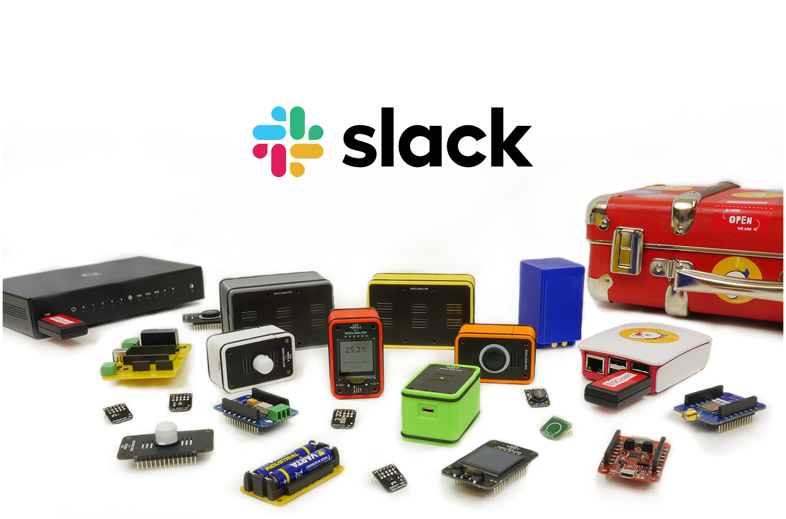
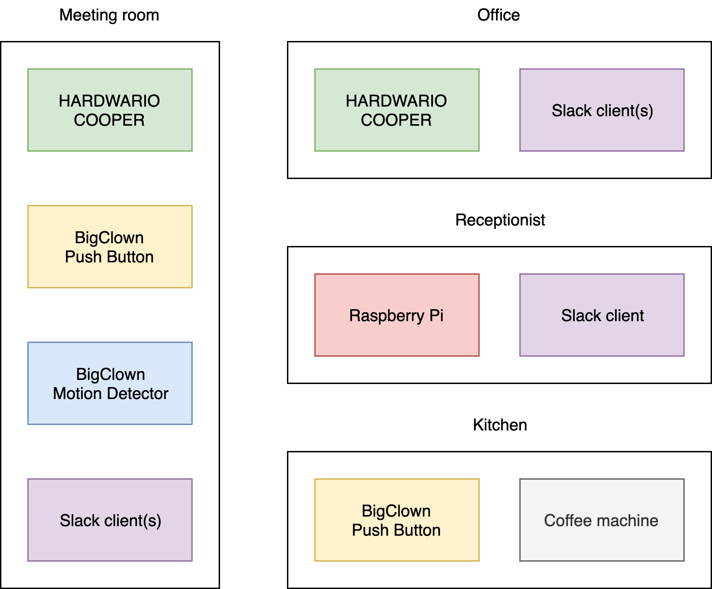
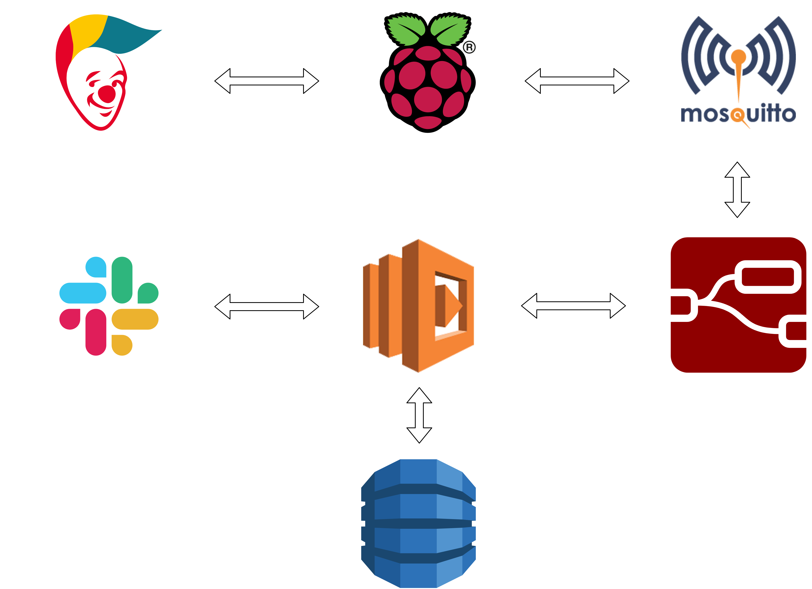

# Slack Gadgets

The ultimate goal of this project is to make office life easier by integrating IoT devices to your Slack workspace.

These are the application use-cases:

* Meeting rooms
  * Push the button and switfly order a tea or coffee
  * Get notified when the air quality is not right

* Shared kitchens
  * Push the button and be notified after some amount of time when the coffee machine finished its job

* Offices
  * Get notified when the air quality is not right

* Reception
  * Receive request notifications about the tea or coffee
  * Be aware when someone entered the meeting room which might not have been booked

The example floor plan could look as follows:

## System Concept

The technology stack consists of the following major technologies:

* BigClown Digital Maker Kit
* Raspberry Pi
* Mosquitto
* Node-RED
* AWS Lambda
* AWS DynamoDB
* and Slack, of course

## Requirements

* HARDWARIO COOPER Sensor
* HARDWARIO COOPER Dongle
* [BigClown Motion Detector Kit](https://shop.bigclown.com/motion-detector-kit/)
* [BigClown Push Button Kit](https://shop.bigclown.com/push-button-kit/)
* [BigClown Hub](https://shop.bigclown.com/bigclown-hub/) (a pre-configured Raspberry Pi)

> The BigClown Hub comes with the Radio Dongle.

## Hub Installation

### Step 1: SSH to BigClown Hub

  ssh pi@hub.local

> The default password is `raspbian`.

### Step 2: Install COOPER packages:

  sudo pip3 install --upgrade cpgw cp2mqtt

### Step 3: Copy configuration files:

[cpgw.yml](edge/cooper/cpgw.yml)
[cp2mqtt.yml](edge/cooper/cp2mqtt.yml)

TODO
